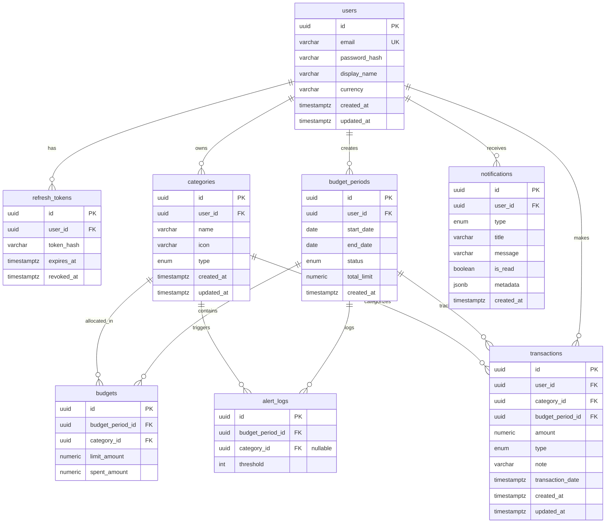

# Deft — Đặc tả kỹ thuật bản thử nghiệm (MVP)

Phạm vi MVP: bỏ Redis/BullMQ, Firebase FCM, Email Provider, WebSocket/SSE, Scheduler/cron. Alert xử lý đồng bộ, notification chỉ ghi in-app. Mục tiêu: vibe code chạy được luồng nghiệp vụ chính trong thời gian ngắn nhất.

---

## 1. Data Model / Schema

### Sơ đồ Thực thể Mối quan hệ (ER Diagram)

### Chi tiết các bảng (Tables)

### `users`
| Cột | Kiểu | Ghi chú |
|---|---|---|
| id | uuid, PK | |
| email | varchar, unique | |
| password_hash | varchar | bcrypt, cost 10 |
| display_name | varchar | |
| currency | varchar | default `'VND'` |
| created_at / updated_at | timestamptz | |

### `refresh_tokens`
| Cột | Kiểu | Ghi chú |
|---|---|---|
| id | uuid, PK | |
| user_id | FK -> users | |
| token_hash | varchar | sha256 của refresh token |
| expires_at | timestamptz | |
| revoked_at | timestamptz, nullable | |

### `categories`
| Cột | Kiểu | Ghi chú |
|---|---|---|
| id | uuid, PK | |
| user_id | FK -> users | |
| name | varchar | |
| icon | varchar, nullable | |
| type | enum('expense','income') | |
| created_at / updated_at | timestamptz | |

### `budget_periods`
| Cột | Kiểu | Ghi chú |
|---|---|---|
| id | uuid, PK | |
| user_id | FK -> users | |
| start_date | date | |
| end_date | date | |
| status | enum('open','closed') | mỗi user chỉ 1 `open` tại 1 thời điểm |
| total_limit | numeric(14,2) | hạn mức tổng toàn kỳ |
| created_at | timestamptz | |

### `budgets` (hạn mức theo category trong 1 kỳ)
| Cột | Kiểu | Ghi chú |
|---|---|---|
| id | uuid, PK | |
| budget_period_id | FK -> budget_periods | |
| category_id | FK -> categories | |
| limit_amount | numeric(14,2) | |
| spent_amount | numeric(14,2) | default 0, cache — cập nhật khi có transaction |
| UNIQUE | (budget_period_id, category_id) | |

### `transactions`
| Cột | Kiểu | Ghi chú |
|---|---|---|
| id | uuid, PK | |
| user_id | FK -> users | |
| category_id | FK -> categories | |
| budget_period_id | FK -> budget_periods | suy ra từ transaction_date khi tạo |
| amount | numeric(14,2) | luôn dương |
| type | enum('expense','income') | copy từ category.type tại thời điểm tạo |
| note | varchar, nullable | |
| transaction_date | timestamptz | |
| created_at / updated_at | timestamptz | |

### `notifications`
| Cột | Kiểu | Ghi chú |
|---|---|---|
| id | uuid, PK | |
| user_id | FK -> users | |
| type | enum('threshold_alert','period_reminder') | |
| title | varchar | |
| message | varchar | |
| is_read | boolean | default false |
| metadata | jsonb, nullable | vd `{category_id, threshold, percent}` |
| created_at | timestamptz | |

### `alert_logs` (chống trùng cảnh báo)
| Cột | Kiểu | Ghi chú |
|---|---|---|
| id | uuid, PK | |
| budget_period_id | FK -> budget_periods | |
| category_id | FK -> categories, nullable | null = ngưỡng tính theo tổng kỳ |
| threshold | int | 50/70/80/100 |
| UNIQUE | (budget_period_id, category_id, threshold) | đảm bảo chỉ báo 1 lần |

**Quan hệ:** users 1–N categories/budget_periods/transactions/notifications; budget_periods 1–N budgets/transactions; categories 1–N budgets/transactions.

**Index cần có:** `transactions(user_id, budget_period_id)`, `transactions(category_id)`, `budgets(budget_period_id, category_id)`.

---

## 2. API Contract

### Auth
| Method | Path | Body | Response |
|---|---|---|---|
| POST | `/auth/register` | `{email, password, display_name}` | `{access_token, refresh_token, user}` |
| POST | `/auth/login` | `{email, password}` | `{access_token, refresh_token, user}` |
| POST | `/auth/refresh` | `{refresh_token}` | `{access_token, refresh_token}` (rotation) |
| POST | `/auth/logout` | `{refresh_token}` | 204 |

### User Settings
| Method | Path | Body | Response |
|---|---|---|---|
| GET | `/users/me` | — | user profile |
| PATCH | `/users/me` | `{display_name?, currency?}` | user profile |

### Categories
| Method | Path | Body |
|---|---|---|
| GET | `/categories` | — |
| POST | `/categories` | `{name, type, icon?}` |
| PATCH | `/categories/:id` | `{name?, icon?}` |
| DELETE | `/categories/:id` | — (chặn xoá nếu còn transaction tham chiếu) |

### Budget Periods
| Method | Path | Body |
|---|---|---|
| GET | `/budget-periods` | — |
| GET | `/budget-periods/current` | — kỳ đang `open` |
| POST | `/budget-periods` | `{start_date, end_date, total_limit}` — tự đóng kỳ open cũ nếu có |
| PATCH | `/budget-periods/:id/close` | — |

### Budgets
| Method | Path | Body |
|---|---|---|
| GET | `/budget-periods/:id/budgets` | — |
| POST | `/budget-periods/:id/budgets` | `{category_id, limit_amount}` (upsert) |
| PATCH | `/budgets/:id` | `{limit_amount}` |

### Transactions
| Method | Path | Body |
|---|---|---|
| GET | `/transactions?category_id=&from=&to=&page=` | — |
| POST | `/transactions` | `{category_id, amount, type, note?, transaction_date}` — trigger cập nhật budgets.spent_amount + check ngưỡng |
| PATCH | `/transactions/:id` | idem, tính lại spent_amount cũ/mới |
| DELETE | `/transactions/:id` | trừ lại spent_amount |

### Summary (Budget Management, read-only)
| Method | Path | Response |
|---|---|---|
| GET | `/budget-periods/:id/summary` | `{total_limit, total_spent, remaining, percent_used, by_category: [{category_id, limit_amount, spent_amount, percent_used}]}` |

### Notifications
| Method | Path | Body |
|---|---|---|
| GET | `/notifications?is_read=&page=` | — |
| PATCH | `/notifications/:id/read` | — |
| PATCH | `/notifications/read-all` | — |

**Mã lỗi chung:** 400 (validation/business rule), 401 (chưa auth), 403 (không sở hữu resource), 404 (không tồn tại), 409 (conflict, vd unique budgets).

---

## 3. Business Rules chi tiết

1. **Công thức:** `percent_used = spent_amount / limit_amount * 100`; `remaining = limit_amount - spent_amount` (có thể âm khi vượt).
2. **Cập nhật spent_amount:** chỉ transaction `type='expense'` mới cộng/trừ vào `budgets.spent_amount` (theo category + kỳ tương ứng). `income` không ảnh hưởng ngân sách chi tiêu.
3. **Gán kỳ cho transaction:** `transaction_date` phải nằm trong `[start_date, end_date]` của kỳ `open` hiện tại → gán `budget_period_id`. Không có kỳ khớp → lỗi 400 "Không có kỳ ngân sách phù hợp".
4. **Một kỳ mở tại một thời điểm:** tạo kỳ mới tự động set kỳ `open` cũ (nếu có) thành `closed`.
5. **Ngưỡng cảnh báo 50/70/80/100%:** check ở 2 cấp độc lập:
   - Theo category (nếu category có `budgets` record trong kỳ).
   - Theo tổng kỳ (`total_spent / total_limit`).
6. **Chống trùng cảnh báo:** trước khi tạo notification, kiểm tra `alert_logs` theo `(budget_period_id, category_id|null, threshold)`; nếu đã tồn tại thì bỏ qua, ngược lại insert log + tạo notification.
7. **Thời điểm check ngưỡng (MVP):** chạy đồng bộ ngay trong request tạo/sửa/xoá transaction (không cần Scheduler/cron riêng).
8. **Xoá category:** chặn nếu còn transaction hoặc budget tham chiếu (trả 409), yêu cầu xoá/chuyển transaction trước.

---

## 4. Auth Flow chi tiết

- **Access token:** JWT, hết hạn **15 phút**, payload `{sub: user_id, email}`, ký bằng secret trong env.
- **Refresh token:** chuỗi random (vd `crypto.randomBytes(40)`), hết hạn **7 ngày**. Lưu **hash (sha256)** trong bảng `refresh_tokens`, không lưu plaintext.
- **Rotation:** mỗi lần gọi `/auth/refresh`, revoke token cũ (`revoked_at = now()`) và cấp cặp access/refresh mới.
- **Header:** `Authorization: Bearer <access_token>` bắt buộc cho mọi endpoint trừ `/auth/*`.
- **Guard NestJS:** `JwtAuthGuard` áp dụng global, decorator `@Public()` để mở endpoint auth.
- **Ownership check:** mọi query theo `user_id` lấy từ JWT payload, không nhận `user_id` từ client.

---

## 5. Danh sách màn hình (UI — MVP)

1. **Đăng nhập / Đăng ký**
2. **Dashboard** — tổng chi kỳ hiện tại, % sử dụng tổng, danh sách category kèm thanh progress
3. **Danh sách giao dịch** — filter theo category/khoảng ngày, phân trang; form thêm/sửa
4. **Quản lý danh mục** — list, thêm/sửa/xoá category
5. **Quản lý kỳ ngân sách** — xem kỳ hiện tại, tạo kỳ mới, đặt hạn mức theo từng category
6. **Trung tâm thông báo** — danh sách notification, đánh dấu đã đọc / đọc tất cả
7. **Cài đặt tài khoản** — đổi tên hiển thị, đơn vị tiền tệ

---

## Việc bị hoãn so với kiến trúc gốc (thêm sau MVP)
- Redis + BullMQ cho queue gửi push/email
- Firebase FCM (push notification)
- Email Provider (SMTP/SendGrid)
- WebSocket/SSE cho realtime dashboard (MVP dùng refetch/polling)
- Scheduler/cron riêng cho đóng/mở kỳ tự động và check ngưỡng định kỳ
